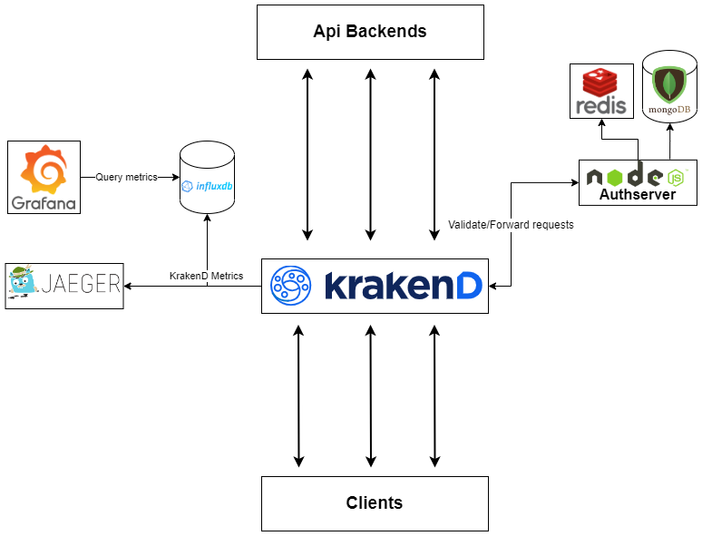

# Api Gateway <!-- omit in toc -->

Krakend Api Gateway with authentication server (optional)

[Authserver docs](/node-authserver/README.md)  
[Krakend docs](https://www.krakend.io/docs/overview/)



## Table of content <!-- omit in toc -->

- [Setup](#setup)
  - [Requirements](#requirements)
- [Configuration](#configuration)
  - [KrakenD](#krakend)
  - [Authserver](#authserver)

## Setup

Quick start KrakenD only using docker

```
docker compose up
```

Quick start KrakenD+Authserver

```
docker compose -f compose-combined.yaml up
```

### Requirements

- Docker
- Docker compose

## Configuration

### KrakenD

Config location: `/krakend/krakend/config/krakend.json`

You can either mount the config to the container or copy it in while you build the docker image.

Krakend recommends you [build your own](https://www.krakend.io/docs/deploying/docker/).

If you do the recommended way you need to rebuild the image every time you change the config.

### Authserver

[Configuring authserver](/node-authserver/README.md#configuration)
